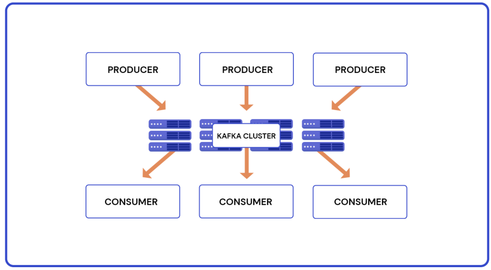

<h1>Comment tester la charge de votre Cluster Kafka</h1>
Apache Kafka est une plateforme de streaming de données open source en temps réel. Il peut collecter, stocker et distribuer des flux de données (événements) sur des applications et des systèmes à grande échelle.

Plus précisément, Kafka fonctionne comme un système de messagerie distribué, envoyant des données sous forme de messages entre producteurs (créateurs de messages) et consommateurs (lecteurs de messages). Les messages sont stockés dans des partitions et distribués sur plusieurs nœuds dans un cluster de serveurs Kafka.

