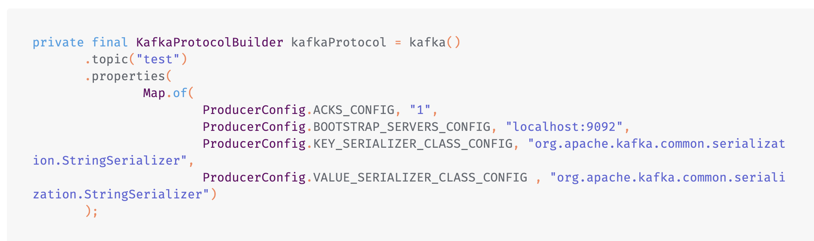
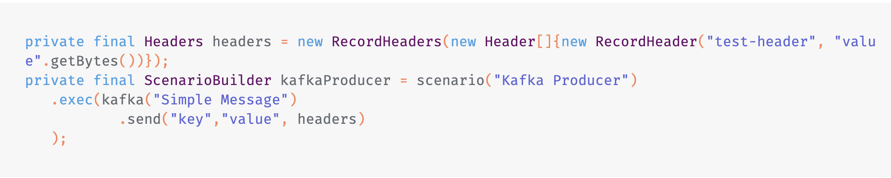

<h1>Comment tester la charge de votre Cluster Kafka</h1>
Apache Kafka est une plateforme de streaming de données open source en temps réel. Il peut collecter, stocker et distribuer des flux de données (événements) sur des applications et des systèmes à grande échelle.

Plus précisément, Kafka fonctionne comme un système de messagerie distribué, envoyant des données sous forme de messages entre producteurs (créateurs de messages) et consommateurs (lecteurs de messages). Les messages sont stockés dans des partitions et distribués sur plusieurs nœuds dans un cluster de serveurs Kafka.

Le Projet est configuré avec Maven

Pour aller plus vite, veuillez cloner le repository dans projet gatling en java

<a href="https://github.com/gatling/gatling-maven-plugin-demo-java">Gatling Java Maven</a>

<h1>Ajouter les dépendances pour Maven</h1>

<h2>
<repositories>
 <repository>
   <id>confluent</id>
   <url>https://packages.confluent.io/maven/</url>
 </repository>
</repositories>
</h2>

<h2>
<dependency>
 <groupId>ru.tinkoff</groupId>
 <artifactId>gatling-kafka-plugin_2.13</artifactId>
 <version>0.11.0</version>
 <scope>test</scope>
</dependency>
</h2>

<h3>
Ajouter lkes importations 
</h3>
import ru.tinkoff.gatling.kafka.javaapi.protocol.*;
import static io.gatling.javaapi.core.CoreDsl.*;
import static ru.tinkoff.gatling.kafka.javaapi.KafkaDsl.*;

<h1>Définissez la configuration de votre cluster</h1>

<h3>
Il crée une configuration KafkaProtocolBuilder avec des paramètres tels que le topic "test", les propriétés du producteur Kafka (ACKS_CONFIG défini sur "1" pour une confirmation simple, les adresses des serveurs Kafka, et les sérialiseurs de clé et de valeur). Cette configuration sera utilisée pour définir le comportement du simulateur de charge Gatling lors de la simulation de la production de messages Kafka

</h3>

<h1>Scénario de test</h1>

Prenons un exemple simple où nous envoyons un message texte avec un en-tête vers notre cluster.

<h2>
Il crée un objet Headers contenant un en-tête nommé "test-header" avec la valeur "value". Ensuite, il définit un scénario appelé "Kafka Producer" qui utilise la configuration KafkaProducerBuilder de Gatling. Dans ce scénario, une exécution est définie pour envoyer un message avec une clé "key", une valeur "value", et l'en-tête défini précédemment. Ainsi, le scénario simule la production d'un message Kafka avec un en-tête spécifique.
</h2>

L'injection du profil en l'occurence les paramétres de test dépendra de votre besoin.
